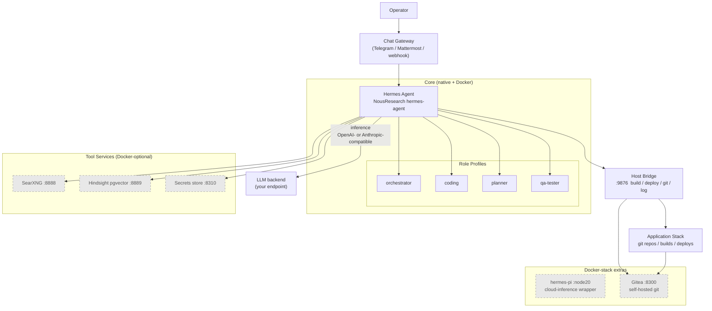

# Architecture Overview

hermes-workflows is a portable scaffold for running a Hermes-style autonomous software-development workflow on your own machine. It is built on the upstream NousResearch hermes-agent driven by role-based profiles, a kanban-backed task board, a custom dispatcher, a three-layer memory system, and a small set of self-hosted tool services. This repo documents two deployment topologies — a **Native launchd+venv install** and an **optional Docker stack** — see [topologies.md](topologies.md).

## The big picture

A human operator interacts via a **chat gateway** surface — for example Telegram, Mattermost, or any webhook-capable chat service. Messages reach the Hermes agent process, which reasons using a configurable **LLM backend**: any OpenAI- or Anthropic-compatible endpoint you supply. The shipped example stub targets a local llama-swap proxy (recommended default) at `http://127.0.0.1:<PORT>` (native Anthropic) — fill in your own key and swap in your preferred backend. See [docs/backend.md](../backend.md).

The agent is structured around multiple **role profiles** — orchestrator, coding, planner, qa-tester — each running as a separate gateway process with its own config, state, and memory directory. A **host-side bridge process** handles privileged operations (build, deploy, git pull, log tail, service restart) that the agent itself should not invoke directly. A suite of **tool services** (web search, semantic memory, secrets) supports the agent's reasoning. The agent's ultimate goal is to operate on an **application code stack** — git repositories, build pipelines, and deployed services.

## Stack diagram

> **Legend:** Dashed/grey nodes are Docker-stack services (optional); the native topology runs the agent and bridge directly on the host. The LLM backend is an external endpoint you configure — it is not bundled with this scaffold.

## Components at a glance

| Component | Role | Native topology | Docker topology |
|---|---|---|---|
| Hermes agent | Autonomous AI agent; orchestrates tasks, calls tools, writes code | Runs as native process under launchd via Python venv | Container in Docker topology |
| Chat gateway | Operator communication surface | Any webhook-capable chat service (e.g. Telegram, Mattermost) | Same — outbound webhook |
| LLM backend | Inference engine; any OpenAI- or Anthropic-compatible endpoint | External — point at your own endpoint (example stub: local llama-swap proxy at `127.0.0.1:<PORT>`) | Same external endpoint; containers may need network bridging |
| Host bridge | Privileged operations: build, deploy, git pull, log tail | Native host process, recommended loopback `:9876` | Reachable from containers via `host.docker.internal:9876` |
| SearXNG | Web search tool for agent | Optional native install | **Docker-optional** (`:8888`) |
| Hindsight | pgvector semantic memory — long-term recall (proposed; not yet wired) | Not present in native topology | **Docker-optional** (`:8889`); sync is a dry-run stub — see [memory.md](../memory.md) |
| Secrets store | Secrets backend | Not present in native topology | **Docker-optional** (`:8310`) — see [docs/backend.md](../backend.md) for secrets approach |
| hermes-pi | Cloud-inference wrapper (`@mariozechner/pi-coding-agent`, node:20-slim) | Not used in native topology | **Docker-only** and optional; enables cloud model delegation |
| Kanban board | Task state machine (todo → ready → in_progress → done) | `kanban.db` SQLite under `HERMES_HOME/` | Same db used in both topologies |
| Dispatcher | Schedules workers per role profile; reaps stalled tasks | Custom asyncio loop, ~60 s tick, runs in agent process | Same logic, different transport in Docker |
| Memory layers | Three-tier: MEMORY.md (rules) / vault (knowledge) / Hindsight (semantic) | Layers 1–2 only (no Hindsight) | Layer 3 (Hindsight) added in Docker topology — proposed, not yet wired |
| Gitea | Self-hosted git server | Not present in native topology | **Docker-only** (`:8300`); optional source-of-truth git |

## Where to go next

- [topologies.md](topologies.md) — Side-by-side comparison of the native launchd+venv and optional Docker deployments; includes the Docker bind gotcha and timeout guidance.
- [ports.md](ports.md) — Authoritative port-map table for every service, bind scopes, and Docker-reachability notes for firewall/network configuration.
- [data-flow.md](data-flow.md) — How a task moves through the kanban+dispatcher lifecycle and how the three memory layers are read and written each turn.
- [backend.md](../backend.md) — LLM backend configuration: bring your own endpoint, the local llama-swap proxy example stub, and secrets handling.
