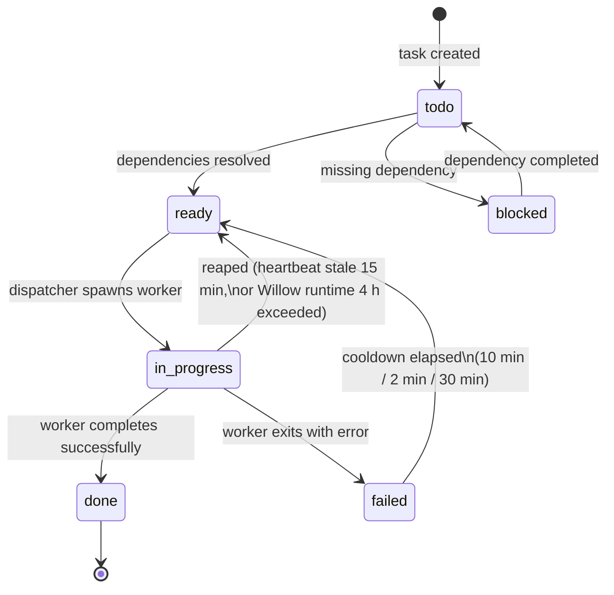
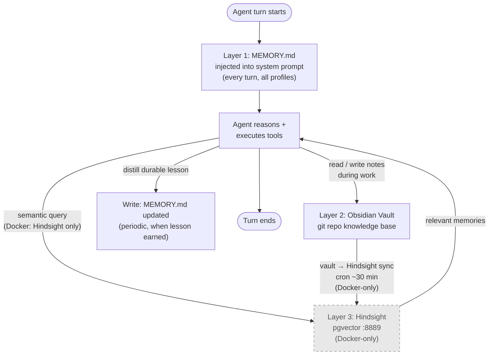

# Data Flow

Two intertwined flows define hermes-workflows at runtime: (1) the **task lifecycle** through the kanban board driven by the dispatcher, and (2) the **memory flow** — what each profile reads and writes every turn. This document describes both, grounded in the reference setup (`kanban.db` + per-profile state under `HERMES_HOME`).

---

## Task lifecycle

### State model

Tasks live in a **kanban board** backed by a SQLite database (`kanban.db` under `HERMES_HOME`). The board is organized into workspaces (`workspaces/` subdir) and maintains structured logs (`logs/` subdir). The primary task states are:

```
todo  →  ready  →  in_progress  →  done
```

Side states:
- **`blocked`** — task has unresolved dependencies or is waiting on external input
- **`failed`** — task exited with an error or was reaped after exceeding runtime limits

### The dispatcher tick

A custom **dispatcher** runs as an asyncio loop on approximately a **60-second tick interval** (configurable default; treat as a design target). Each tick performs the following operations in order:

1. **Promote `todo` → `ready`**: inspects dependency graphs; any task whose dependencies are all in `done` state is promoted to `ready`.
2. **Reap stalled workers**: checks heartbeat timestamps on all `in_progress` tasks. Workers that have gone silent beyond the configured thresholds are reaped (moved back to `ready` or `failed`).
3. **Dispatch at most one task per profile**: for each role profile that currently has no active worker, picks the highest-priority `ready` task assigned to that role and spawns a worker.
4. **Diff board state**: compares current board state against the previous tick's snapshot; the chat gateway is notified only on actual changes — no repeated noise messages when nothing has changed.

**Dispatcher parameters** (configurable defaults — treat as design targets):

| Parameter | Value | Purpose |
|---|---|---|
| Tick interval | ~60 s | How often the dispatcher loop runs |
| Heartbeat stale threshold | 15 min | Worker is considered hung and reaped after 15 min silence |
| Startup grace period | 60 min | New workers get 60 min before the stale check kicks in |
| Willow runtime | 4 h | Absolute cap; worker reaped regardless of heartbeat |
| Normal spawn cooldown | 10 min | Delay before retrying a failed task under normal conditions |
| Fast-retry cooldown | 2 min | Used when the failure looks transient (e.g., network error) |
| Cooldown after 3+ consecutive failures | 30 min | Backs off aggressively to avoid spinning on a broken task |

### One-task-per-profile + dependency gating

A task only becomes `ready` when **all of its declared dependencies are in the `done` state**. Each role profile (orchestrator / coding / planner / qa-tester) runs **at most one active worker at a time** — a second task assigned to the same profile waits until the first completes or is reaped. The orchestrator profile additionally owns the dispatcher loop itself, cron scheduling, and chat gateway interaction.

### Task state diagram



---

## Profiles and dispatch

Each profile is a **separate gateway process** with its own `config.yaml`, `state.db`, `memories/`, `cron/`, and `plans/` directory under `HERMES_HOME/profiles/<role>/`.

| Conceptual role | Responsibilities |
|---|---|
| orchestrator | Owns the dispatcher loop, cron scheduling, chat gateway, task assignment across profiles |
| coding | Executes implementation tasks — writing, refactoring, and testing code |
| planner | Research, task decomposition, daily planning notes |
| qa-tester | Playwright / E2E verification; reports pass/fail; does not fix code |

Choose your own profile directory names — the conceptual roles above are the model used throughout this documentation.

---

## Memory flow (three layers)

The agent's memory is organized into three layers, each serving a different timescale and access pattern. This section describes the **structure and flow** — not the contents (which are private and never reproduced here).

### Layer 1 — Per-profile MEMORY.md (behavioral rules)

- **What it is:** A small text file (`memories/MEMORY.md`) inside each profile's directory. Capped at approximately 2,200 characters.
- **Contents:** Durable behavioral rules — how this profile should act, patterns to follow, things to avoid. No transient task data.
- **Lifecycle:** Read and injected into the **system prompt on every turn**. Written (appended or revised) when the agent distills a new durable lesson from experience.

### Layer 2 — Obsidian vault (knowledge base)

- **What it is:** A structured folder hierarchy committed as a git repository, forming the agent's durable human-readable working memory.
- **Structure:**
  ```
  vault/
  ├── Architecture/     # system and infrastructure knowledge
  ├── Operations/       # runbooks, procedures, operational notes
  ├── Research/         # investigation outputs, findings
  ├── Project/          # project-specific working notes (own git repo)
  ├── Meta/
  │   └── hermes-learnings/  # distilled lessons about hermes itself
  ├── Security/         # security findings, policies
  └── Strategy/         # planning and strategic notes
  ```
- **Lifecycle:** The agent reads vault notes during reasoning and writes new or updated notes as it works. This is the primary **working memory** for the session.

### Layer 3 — Hindsight (pgvector semantic memory) [Docker-only, proposed]

> **Proposed / not yet implemented.** The Docker stack ships a bare pgvector container and the sync script is a dry-run stub. The Hindsight ingest API is not yet wired end-to-end. This section describes the intended design.

- **What it is:** A pgvector database (`:8889`) that stores vector embeddings of vault content, enabling semantic similarity search over the agent's entire knowledge history.
- **Intended lifecycle:** The vault is synced into Hindsight on a scheduled cron (approximately every 30 minutes). The agent queries Hindsight to retrieve contextually relevant long-term memories that would not fit directly in the prompt.
- **Docker dependency:** Layer 3 is a **Docker-stack component**. In the native topology this layer is optional and may be omitted entirely. The agent functions with Layers 1 and 2 only; Hindsight adds recall depth for longer-running contexts once wired.

### Read/write sequence per turn



> **Structure only:** This document describes the memory architecture pattern. Actual `MEMORY.md` contents, vault note bodies, and database contents are private and are never reproduced in this repository.

---

## Skills injection

Skills are **pre-written prompt fragments** that give the agent specific capabilities (e.g., "how to run a git operation", "how to call the bridge", "how to write a test"). They live under `HERMES_HOME/skills/`.

Skills are loaded via a **whitelist (include-list)** mechanism: only the skills explicitly listed in the profile config enter the system prompt each turn. This prevents prompt bloat from a large skill library — the agent only carries the tool definitions it actually needs. The whitelist is defined per profile, allowing different roles to have different skill sets.

See [docs/skills-whitelist.md](../skills-whitelist.md) for the format and management of the whitelist.

---

## Crons (operational loops)

The agent runs approximately ten scheduled jobs distributed across profiles (starter template — adopt the jobs your workflow actually needs). Per-profile cron definitions live under `HERMES_HOME/profiles/<role>/cron/`.

| Cron job | Interval | Purpose |
|---|---|---|
| RAM watchdog | frequent (sub-minute) | Monitors host memory; restarts heaviest worker or alerts if pressure too high |
| Stale-worker watchdog | 15 min | Redundant reaper for hung workers (complements dispatcher tick) |
| Dispatcher health check | 15 min | Verifies the dispatcher loop is alive; restarts if stalled |
| Vault → Hindsight sync | ~30 min | Embeds updated vault notes into pgvector for semantic recall (**Docker-dependent: requires Hindsight — proposed, not yet wired**) |
| Board hygiene | 30 min | Cleans up stale `done`/`failed` entries; compacts kanban.db |
| Post-work audit | 30 min | Reviews completed task outputs; flags quality issues for follow-up |
| Redeploy on git SHA drift | 1 h | Compares deployed SHA against git HEAD; triggers redeploy if drift detected |
| Inference live-probe | 4 h | Sends a minimal request to `${LLM_BASE_URL}` to verify the configured backend is reachable and responding |
| Planner daily note | 22:00 | Orchestrates the planner profile to generate a next-day plan from the current board state |
| kanban.db backup | 03:00 | Copies `kanban.db` to a backup location (e.g., Gitea or local archive) |

> **Docker dependency note:** The Vault → Hindsight sync cron requires Layer 3 (Hindsight at `:8889`). In the native topology without Docker, this cron should be disabled or left as a no-op.

---

## See also

- [README.md](README.md) — System overview with the full stack diagram and component table
- [topologies.md](topologies.md) — Native vs. Docker deployment comparison; backend networking considerations; timeout guidance
- [ports.md](ports.md) — Authoritative port map for all services with bind scopes and Docker-reachability notes